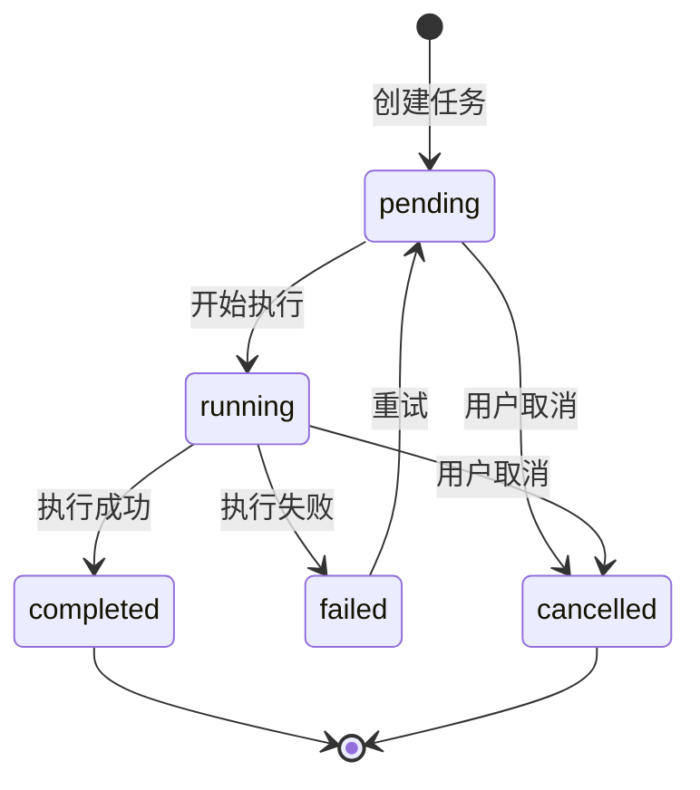
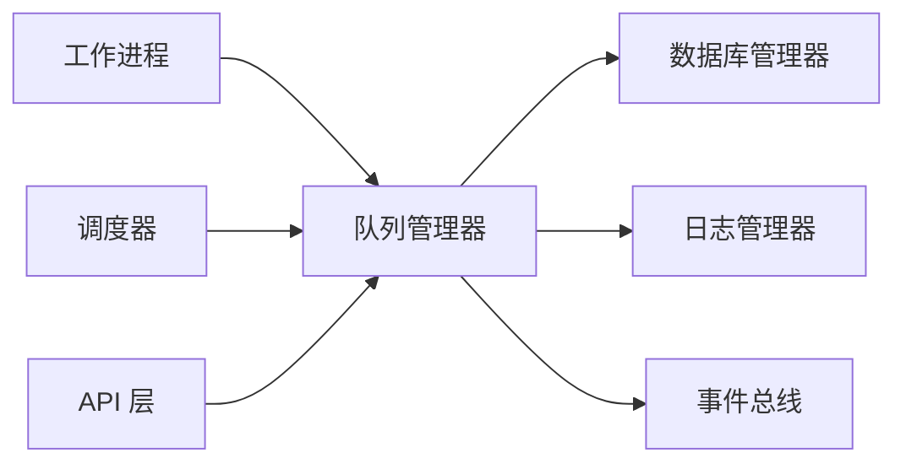

# 队列管理器详细设计文档

## 1. 模块概述

### 1.1 功能定位

队列管理器是 SRT Flow 任务调度系统的核心组件，负责管理基于 SQLite 的持久化任务队列。它提供任务的入队、出队、状态更新等操作，确保任务在系统重启后不丢失，并支持优先级调度。

### 1.2 核心职责

- **任务入队**：将新任务添加到队列，支持优先级设置
- **任务出队**：按优先级和创建时间获取待执行任务
- **状态管理**：更新任务状态、进度、结果
- **持久化存储**：基于 SQLite 确保任务不丢失
- **并发控制**：确保每种任务类型最多一个并发
- **重试机制**：支持失败任务的重试调度

### 1.3 设计原则

- **持久化优先**：所有任务状态变更立即持久化
- **原子操作**：状态变更使用数据库事务保证一致性
- **公平调度**：同优先级任务按 FIFO 顺序执行
- **可观测性**：提供队列状态查询接口

---

## 2. 任务状态机设计

### 2.1 状态定义



### 2.2 状态说明

| 状态 | 说明 | 可转换到 |
|------|------|----------|
| pending | 等待执行 | running, cancelled |
| running | 正在执行 | completed, failed, cancelled |
| completed | 执行成功 | - |
| failed | 执行失败 | pending (重试) |
| cancelled | 已取消 | - |

### 2.3 状态转换规则

```python
from enum import Enum
from typing import Set, Dict


class TaskStatus(str, Enum):
    PENDING = "pending"
    RUNNING = "running"
    COMPLETED = "completed"
    FAILED = "failed"
    CANCELLED = "cancelled"


# Valid state transitions
VALID_TRANSITIONS: Dict[TaskStatus, Set[TaskStatus]] = {
    TaskStatus.PENDING: {TaskStatus.RUNNING, TaskStatus.CANCELLED},
    TaskStatus.RUNNING: {TaskStatus.COMPLETED, TaskStatus.FAILED, TaskStatus.CANCELLED},
    TaskStatus.FAILED: {TaskStatus.PENDING},  # Retry
    TaskStatus.COMPLETED: set(),
    TaskStatus.CANCELLED: set(),
}


def can_transition(from_status: TaskStatus, to_status: TaskStatus) -> bool:
    """检查状态转换是否合法"""
    return to_status in VALID_TRANSITIONS.get(from_status, set())
```


---

## 3. 队列表结构设计

### 3.1 tasks 表（复用数据库管理器定义）

```sql
CREATE TABLE IF NOT EXISTS tasks (
    id VARCHAR(36) PRIMARY KEY,
    video_id VARCHAR(36) REFERENCES videos(id),
    type VARCHAR(50) NOT NULL,            -- 任务类型
    status VARCHAR(20) NOT NULL DEFAULT 'pending',
    progress INTEGER DEFAULT 0,           -- 进度 0-100
    priority VARCHAR(10) DEFAULT 'normal', -- high, normal, low
    payload JSON,                         -- 任务参数
    result JSON,                          -- 执行结果
    error TEXT,                           -- 错误信息
    retry_count INTEGER DEFAULT 0,
    max_retries INTEGER DEFAULT 3,
    created_at TIMESTAMP DEFAULT CURRENT_TIMESTAMP,
    started_at TIMESTAMP,
    completed_at TIMESTAMP,
    scheduled_at TIMESTAMP,               -- 计划执行时间（用于延迟任务）
    
    CHECK(status IN ('pending', 'running', 'completed', 'failed', 'cancelled')),
    CHECK(priority IN ('high', 'normal', 'low'))
);

-- 队列查询优化索引
CREATE INDEX idx_tasks_queue ON tasks(status, priority DESC, created_at ASC)
    WHERE status = 'pending';
CREATE INDEX idx_tasks_running ON tasks(type, status) WHERE status = 'running';
```

### 3.2 任务类型定义

```python
from enum import Enum


class TaskType(str, Enum):
    """任务类型枚举"""
    DOWNLOAD = "download"       # 视频下载
    ASR = "asr"                 # 语音识别
    TRANSLATE = "translate"     # 字幕翻译
    TTS = "tts"                 # 语音合成
    SYNTHESIZE = "synthesize"   # 视频合成
    ASSET_GEN = "asset_gen"     # 素材生成


class TaskPriority(str, Enum):
    """任务优先级"""
    HIGH = "high"       # 插队任务（重试时选择）
    NORMAL = "normal"   # 普通任务
    LOW = "low"         # 低优先级任务
```

### 3.3 任务数据模型

```python
from pydantic import BaseModel, Field
from typing import Optional, Any, Dict
from datetime import datetime
import uuid


class TaskCreate(BaseModel):
    """创建任务请求"""
    type: TaskType
    video_id: Optional[str] = None
    payload: Dict[str, Any] = Field(default_factory=dict)
    priority: TaskPriority = TaskPriority.NORMAL
    scheduled_at: Optional[datetime] = None


class TaskUpdate(BaseModel):
    """更新任务请求"""
    status: Optional[TaskStatus] = None
    progress: Optional[int] = Field(None, ge=0, le=100)
    result: Optional[Dict[str, Any]] = None
    error: Optional[str] = None


class TaskInfo(BaseModel):
    """任务信息响应"""
    id: str
    type: TaskType
    status: TaskStatus
    progress: int
    priority: TaskPriority
    video_id: Optional[str]
    payload: Dict[str, Any]
    result: Optional[Dict[str, Any]]
    error: Optional[str]
    retry_count: int
    created_at: datetime
    started_at: Optional[datetime]
    completed_at: Optional[datetime]
    
    class Config:
        from_attributes = True
```

---

## 4. 优先级调度逻辑

### 4.1 优先级规则

1. **优先级排序**：high > normal > low
2. **同优先级 FIFO**：相同优先级按创建时间排序
3. **类型并发限制**：每种任务类型最多 1 个 running

### 4.2 出队算法

```python
from sqlalchemy import select, case, and_
from sqlalchemy.ext.asyncio import AsyncSession


async def dequeue_task(
    session: AsyncSession,
    task_type: Optional[TaskType] = None,
) -> Optional[Task]:
    """
    从队列获取下一个待执行任务
    
    Args:
        session: 数据库会话
        task_type: 指定任务类型（可选）
    
    Returns:
        待执行任务，无可用任务返回 None
    """
    # Check if there's already a running task of this type
    if task_type:
        running_stmt = select(Task).where(
            Task.type == task_type.value,
            Task.status == TaskStatus.RUNNING.value
        )
        running = await session.execute(running_stmt)
        if running.scalar_one_or_none():
            return None  # Already has running task of this type
    
    # Priority ordering: high=1, normal=2, low=3
    priority_order = case(
        (Task.priority == "high", 1),
        (Task.priority == "normal", 2),
        (Task.priority == "low", 3),
    )
    
    # Build query
    stmt = select(Task).where(
        Task.status == TaskStatus.PENDING.value,
        # Only get tasks that are scheduled for now or earlier
        (Task.scheduled_at.is_(None)) | (Task.scheduled_at <= datetime.utcnow())
    )
    
    if task_type:
        stmt = stmt.where(Task.type == task_type.value)
    
    stmt = stmt.order_by(priority_order, Task.created_at.asc()).limit(1)
    
    # Use FOR UPDATE to prevent race conditions
    stmt = stmt.with_for_update(skip_locked=True)
    
    result = await session.execute(stmt)
    return result.scalar_one_or_none()
```

### 4.3 并发控制

```python
async def can_start_task(session: AsyncSession, task_type: TaskType) -> bool:
    """
    检查是否可以启动指定类型的任务
    
    每种任务类型最多允许 1 个并发执行
    """
    stmt = select(Task).where(
        Task.type == task_type.value,
        Task.status == TaskStatus.RUNNING.value
    )
    result = await session.execute(stmt)
    running_task = result.scalar_one_or_none()
    return running_task is None


async def get_running_tasks_by_type(session: AsyncSession) -> Dict[str, Task]:
    """获取每种类型正在运行的任务"""
    stmt = select(Task).where(Task.status == TaskStatus.RUNNING.value)
    result = await session.execute(stmt)
    tasks = result.scalars().all()
    return {task.type: task for task in tasks}
```


---

## 5. 核心功能设计

### 5.1 任务入队

**功能描述**：将新任务添加到持久化队列中。

**处理流程**：
1. 验证任务参数（类型、payload 格式）
2. 生成唯一任务 ID（UUID）
3. 设置初始状态为 `pending`
4. 写入数据库
5. 返回任务信息

**特殊场景**：
- 支持设置 `scheduled_at` 实现延迟任务
- 支持设置优先级，`high` 优先级任务会插队执行
- 如果指定了 `video_id`，会验证视频是否存在

### 5.2 任务出队

**功能描述**：获取下一个待执行的任务。

**调度规则**：
1. 只获取状态为 `pending` 的任务
2. 检查 `scheduled_at`，只获取已到执行时间的任务
3. 按优先级排序：high > normal > low
4. 同优先级按创建时间 FIFO 排序
5. 检查并发限制：该类型是否已有 running 任务

**并发安全**：
- 使用数据库行锁（SELECT FOR UPDATE）防止多个 Worker 获取同一任务
- SQLite 使用 IMMEDIATE 事务模式确保原子性

### 5.3 状态更新

**功能描述**：更新任务的执行状态和进度。

**状态转换验证**：
- 每次状态变更前验证转换是否合法
- 非法转换抛出异常，防止状态混乱

**时间戳自动更新**：
- 转为 `running` 时设置 `started_at`
- 转为 `completed`/`failed`/`cancelled` 时设置 `completed_at`

**进度更新**：
- 进度值范围 0-100
- 支持增量更新和绝对值更新

### 5.4 任务重试

**功能描述**：将失败任务重新加入队列。

**重试策略**：
- 检查 `retry_count` 是否小于 `max_retries`
- 重试时 `retry_count` 加 1
- 状态从 `failed` 转为 `pending`
- 可选择优先级：`high`（插队）或 `normal`（排队）

**重试限制**：
- 默认最大重试次数为 3
- 超过重试次数的任务保持 `failed` 状态

### 5.5 任务取消

**功能描述**：取消待执行或正在执行的任务。

**处理逻辑**：
- `pending` 状态：直接标记为 `cancelled`
- `running` 状态：标记为 `cancelled`，通知 Worker 中断执行
- `completed`/`failed`/`cancelled` 状态：不可取消

---

## 6. 队列管理器接口

### 6.1 核心方法

| 方法 | 参数 | 返回值 | 说明 |
|------|------|--------|------|
| `enqueue` | task_type, video_id, payload, priority | TaskInfo | 任务入队 |
| `dequeue` | task_type (可选) | TaskInfo \| None | 获取待执行任务 |
| `update_status` | task_id, status, progress, error, result | TaskInfo | 更新任务状态 |
| `update_progress` | task_id, progress | TaskInfo | 更新任务进度 |
| `retry` | task_id, priority | TaskInfo | 重试失败任务 |
| `cancel` | task_id | bool | 取消任务 |
| `get_task` | task_id | TaskInfo \| None | 获取任务详情 |
| `get_tasks` | filters, page, page_size | List[TaskInfo] | 查询任务列表 |
| `get_queue_stats` | - | QueueStats | 获取队列统计 |

### 6.2 查询过滤器

支持的过滤条件：
- `status`：按状态过滤
- `type`：按任务类型过滤
- `video_id`：按关联视频过滤
- `created_after`：创建时间范围
- `created_before`：创建时间范围

### 6.3 队列统计信息

| 字段 | 说明 |
|------|------|
| `total` | 总任务数 |
| `pending` | 待执行数 |
| `running` | 执行中数 |
| `completed` | 已完成数 |
| `failed` | 失败数 |
| `by_type` | 按类型统计 |

---

## 7. 事件通知机制

### 7.1 任务事件

队列管理器在关键操作时发出事件通知：

| 事件 | 触发时机 | 携带数据 |
|------|----------|----------|
| `task.created` | 任务入队 | task_id, type, video_id |
| `task.started` | 任务开始执行 | task_id, type |
| `task.progress` | 进度更新 | task_id, progress |
| `task.completed` | 任务完成 | task_id, result |
| `task.failed` | 任务失败 | task_id, error |
| `task.cancelled` | 任务取消 | task_id |

### 7.2 事件用途

- **WebSocket 推送**：实时通知前端任务状态变化
- **日志记录**：记录任务生命周期
- **流水线触发**：任务完成后自动触发下游任务

---

## 8. 错误处理

### 8.1 异常类型

| 异常 | 说明 |
|------|------|
| `TaskNotFoundError` | 任务不存在 |
| `InvalidStateTransitionError` | 非法状态转换 |
| `MaxRetriesExceededError` | 超过最大重试次数 |
| `TaskAlreadyRunningError` | 该类型已有任务在执行 |
| `QueueOperationError` | 队列操作失败 |

### 8.2 错误恢复

**系统重启恢复**：
- 启动时扫描 `running` 状态的任务
- 将意外中断的任务重置为 `pending` 或 `failed`
- 根据任务类型决定是否可安全重试

**数据库错误**：
- 使用事务确保操作原子性
- 失败时回滚，保持数据一致性

---

## 9. 性能优化

### 9.1 索引优化

- 队列查询索引：`(status, priority, created_at)` 复合索引
- 类型查询索引：`(type, status)` 用于并发检查
- 视频关联索引：`(video_id)` 用于查询视频相关任务

### 9.2 查询优化

- 出队查询使用 `LIMIT 1` 减少扫描
- 使用部分索引（WHERE status='pending'）加速队列查询
- 统计查询使用 `COUNT` 聚合，避免全表扫描

### 9.3 批量操作

- 支持批量入队，减少数据库往返
- 批量状态更新用于任务组操作

---

## 10. 依赖关系



---

## 11. 测试要点

### 11.1 功能测试

- [ ] 任务入队和出队
- [ ] 优先级排序正确性
- [ ] 状态转换验证
- [ ] 重试机制
- [ ] 取消功能

### 11.2 并发测试

- [ ] 多 Worker 竞争出队
- [ ] 同类型任务并发限制
- [ ] 事务隔离性

### 11.3 边界测试

- [ ] 空队列出队
- [ ] 最大重试次数
- [ ] 大量任务入队性能

---

*文档版本: v1.0*  
*创建日期: 2024-12-15*  
*作者: Kiro*