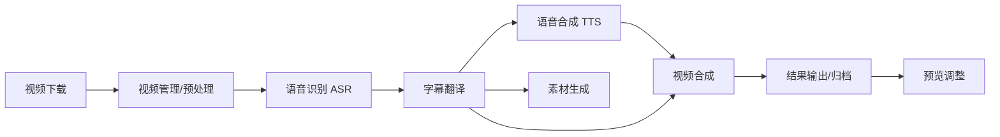

# SRT Flow 系统架构文档

## 1. 系统业务流程

本系统采用"流水线"式业务处理流程，各环节既可独立运行，也可串联执行。



### 业务流程说明

1. **视频下载**：用户输入 URL，系统调用下载工具（yt-dlp/BiliDown）获取视频及元数据
2. **视频管理**：自动归档，生成唯一 ID，打标签（来源、用户、Channel、长度、大小等），支持用户自定义分组
3. **语音识别**：提取音频，调用 Whisper（本地）或在线大模型生成原始字幕
4. **字幕翻译**：调用 LLM（DeepSeek R1/Gemini/OpenAI）将原始字幕翻译为目标语言，支持批次处理
5. **语音合成**：（可选）将翻译后的字幕转换为语音，支持语速计算和探测
6. **素材生成**：（并行）基于字幕内容生成标题、摘要、缩略图（截取视频帧或 LLM 生成提示词调用绘图接口）
7. **视频合成**：将新字幕、新语音与原视频画面合成，支持可配置的字幕样式
8. **预览调整**：提供预览和编辑界面，允许用户调整结果

## 2. 系统技术架构

采用前后端分离架构，容器化部署。

### 2.1 前端 (Frontend)

- **框架**: Vue.js 3 + Pinia (状态管理)
- **交互方式**: 
  - Axios (API 请求)
  - WebSocket/轮询 (实时状态更新)
- **核心职责**: 
  - 任务提交与管理
  - 实时状态展示
  - 结果预览与编辑
  - 配置管理（每个功能独立配置页面 + 系统全局配置）

### 2.2 后端 (Backend)

- **核心框架**: FastAPI (Python 3.12)
- **API 风格**: RESTful API
- **任务调度**: 自研基于 SQLite 的持久化任务队列
- **核心职责**: 
  - 业务逻辑编排
  - 外部工具调用
  - 文件管理
  - 队列调度与并发控制

### 2.3 数据存储 (Storage)

- **数据库**: SQLite
  - 任务状态与队列
  - 视频元数据（标题、时长、上传者、标签等）
  - 系统配置（敏感信息加密存储）
  - 用户自定义分组
  
- **文件系统**: 本地文件系统
  - 视频文件
  - 字幕文件
  - 音频文件
  - 素材文件
  - 日志文件

### 2.4 外部依赖 (External Tools)

- **视频下载**: `yt-dlp`, `BiliDown`
- **音视频处理**: `ffmpeg`
- **语音识别**: `Whisper` (本地), 在线大模型（Gemini 等）
- **字幕翻译**: LLM API (DeepSeek R1, Gemini, OpenAI)
- **语音合成**: 本地 TTS 引擎（Coqui TTS, ChatTTS, SparkTTS, IndexTTS, CozyVoice, VITS 系）
- **素材生成**: LLM API + 绘图接口（可配置）

## 3. 模块设计

遵循高内聚、低耦合原则，各模块通过定义良好的接口交互。

### 3.1 核心模块

- **配置管理器**: 
  - 统一管理系统配置（.env）和用户配置（SQLite）
  - 敏感信息加密存储（API Key 等）
  - 前端脱敏显示（只能修改，不能查询明文）
  - 详细设计：`docs/01-核心-配置管理器设计.md`
  
- **数据库管理器**: 
  - SQLite 连接池管理
  - ORM 映射（SQLAlchemy）
  - 异步数据库操作
  - 详细设计：`docs/02-核心-数据库管理器设计.md`
  
- **日志管理器**: 
  - 统一日志记录
  - 按任务 ID 分流日志文件
  - 支持详细的执行过程记录
  - 详细设计：`docs/03-核心-日志管理器设计.md`

### 3.2 任务调度模块

- **队列管理器**: 
  - 基于 SQLite 的持久化队列实现
  - 支持任务入队、出队、状态更新
  - 支持任务优先级（重启任务可插队或排队）
  - 详细设计：`docs/04-调度-队列管理器设计.md`
  
- **工作进程**: 
  - 消费者进程，从队列获取任务
  - 分发任务给具体执行模块
  - 并发控制：每种任务类型最多 1 个并发
  - 不同功能之间允许并行（流水线操作）
  - 详细设计：`docs/05-调度-工作进程设计.md`
  
- **调度器**: 
  - 定时检查任务状态
  - 错误自动重试与调度
  - 任务时段控制（每个功能可设置独立的允许执行时段）
  - 任务进度计算与更新
  - 详细设计：`docs/06-调度-调度器设计.md`

### 3.3 业务功能模块

所有服务实现统一的接口规范，包含任务执行、取消、进度获取等方法。

#### 3.3.1 下载服务
- 封装 yt-dlp/BiliDown 工具
- 处理视频下载逻辑
- 去重检查（基于来源 + 外部 ID）
- 元数据提取与存储
- 详细设计：`docs/07-服务-下载服务设计.md`

#### 3.3.2 媒体管理服务
- 文件扫描与索引
- 元数据解析
- 标签自动生成与管理
- 用户自定义分组管理
- 文件关联（允许用户关联自行处理的结果文件）
- 详细设计：`docs/08-服务-媒体管理服务设计.md`

#### 3.3.3 语音识别服务
- Whisper 模型加载与推理（支持模型大小配置）
- 在线大模型调用（备选方案）
- 音频提取
- 字幕生成（.srt 格式）
- 详细设计：`docs/09-服务-语音识别服务设计.md`

#### 3.3.4 翻译服务
- LLM API 调用封装
- 字幕格式解析与重组
- 批次处理（如每 30 条字幕为一批）
- 进度计算（基于批次）
- 详细设计：`docs/10-服务-翻译服务设计.md`

#### 3.3.5 语音合成服务
- 多引擎支持（Coqui TTS, ChatTTS, SparkTTS, IndexTTS, CozyVoice, VITS 系）
- 语速计算（根据字幕长度和字数）
- 合成语音速度探测
- 长文本切分与处理
- GPU 加速支持
- 输出格式可配置（.wav 或 .m4a）
- 详细设计：`docs/11-服务-语音合成服务设计.md`

#### 3.3.6 视频合成服务
- FFMPEG 命令封装
- 音视频合成
- 字幕烧录（支持可配置样式：字体、大小、颜色、位置、边框、阴影、背景色、动画效果）
- 音轨替换（可选：完全静音原视频）
- 进度计算（基于 FFMPEG 输出）
- 详细设计：`docs/12-服务-视频合成服务设计.md`

#### 3.3.7 素材生成服务
- LLM 调用封装
- 标题生成
- 摘要生成
- 缩略图生成（截取视频帧或 LLM 生成提示词 + 绘图接口）
- 详细设计：`docs/13-服务-素材生成服务设计.md`

#### 3.3.8 编辑服务
- 简单剪辑功能（低优先级）
- 视频预览
- 切分多段
- 详细设计：`docs/14-服务-编辑服务设计.md`

## 4. 视频目录管理体系设计

采用"一视频一目录"的结构，确保文件条理清晰，便于迁移和备份。

**根目录**: `data/downloads/`

```text
data/downloads/
├── <Video_UUID>_<Safe_Title>/       # 视频独立目录
│   ├── video.mp4                    # 原始视频
│   ├── video.info.json              # 元数据（JSON 格式）
│   ├── audio_original.m4a           # 提取的原声音频
│   ├── subtitle_original.srt        # 识别出的源语言字幕
│   ├── subtitle_translated.srt      # 翻译后的目标语言字幕
│   ├── audio_tts.m4a                # 合成的语音（格式可配置）
│   ├── video_output.mp4             # 最终合成视频
│   ├── assets/                      # 素材子目录
│   │   ├── thumbnail.jpg            # 缩略图
│   │   ├── summary.txt              # 摘要
│   │   └── title_candidates.txt     # 标题候选
│   └── task.log                     # 该视频处理过程的日志
└── ...
```

### 文件命名规范

- **视频目录**: `<UUID>_<安全标题>`（标题中特殊字符转换为下划线）
- **元数据文件**: `video.info.json`（包含来源、上传者、Channel、时长等信息）
- **日志文件**: `task.log`（记录所有任务执行过程）

## 5. 任务管理机制

### 5.1 任务组概念

- 每个功能均支持把视频打包成任务组一次性提交
- 任务组本身也会成为视频标签，方便后续功能中选择
- 支持按组提交排队流水线操作

### 5.2 任务状态管理

- **状态**: pending（待执行）, running（执行中）, completed（已完成）, failed（失败）
- **异步处理**: 前端发起任务后，后端立即返回，前端轮询任务状态
- **错误处理**: 任务失败自动记录错误，调度下一个任务
- **任务重启**: 用户可重启失败任务，可指定插队或排队

### 5.3 任务进度机制

- **主动拆分**: 系统将任务拆分为批次（如字幕翻译每 30 条一批），根据批次计算进度
- **被动接收**: 从外部工具（如 FFMPEG）读取处理情况，计算进度
- **实时更新**: 通过 WebSocket 或轮询向前端推送进度

### 5.4 任务时段控制

- 每个功能可设置独立的允许执行时段
- 启动任务时检查是否在允许时段
- 不在时段则自动进入排队等待状态

## 6. 部署方案设计

使用 Docker Compose 进行一键部署。

### 6.1 容器规划

**单容器方案**: 
- 包含 FastAPI 后端 + Vue 前端构建产物（由 FastAPI StaticFiles 托管）
- 包含所有 Python 依赖
- 包含系统工具（ffmpeg, yt-dlp）
- 包含 TTS 引擎和 Whisper 模型

**理由**: 
- 本项目为单人工具，单容器部署可减少资源开销和运维复杂度
- 简化网络配置和服务发现

**挂载**: 
- 映射宿主机 `data/` 目录到容器内，确保数据持久化
- 映射宿主机 `config/` 目录，方便配置管理

**GPU 支持**: 
- 配置 NVIDIA Runtime 以支持 Whisper/TTS GPU 加速

### 6.2 端口配置

- **服务端口**: 8010
- **WebSocket**: 使用同一端口（通过路径区分）

## 7. 项目目录规划

项目根目录结构如下（控制深度，保持扁平）：

```text
srt-flow/
├── backend/            # 后端代码
│   ├── app/            # FastAPI 应用入口
│   ├── services/       # 业务逻辑模块（ASR, TTS, Translator 等）
│   ├── core/           # 核心组件（DB, Config, Logger）
│   └── workers/        # 任务队列消费者
├── frontend/           # 前端代码（Vue.js）
│   ├── src/            # 源代码
│   └── public/         # 静态资源
├── deploy/             # 部署相关文件
│   ├── Dockerfile
│   └── docker-compose.yml
├── docs/               # 项目文档
├── scripts/            # 辅助脚本（初始化、迁移等）
├── tasks/              # 任务详情文件（项目管理）
├── requirements.txt    # Python 依赖
├── KANBAN.md           # 项目看板
└── README.md           # 项目说明
```

## 8. 安全与配置管理

### 8.1 配置分层

- **系统级配置**: 使用 .env 文件（数据库路径、文件存储路径等）
- **功能级配置**: 存储在 SQLite（每个功能独立配置）
- **全局配置**: 存储在 SQLite（项目共用配置）

### 8.2 敏感信息处理

- **加密存储**: API Key 等敏感信息在 SQLite 中加密存储
- **前端脱敏**: 前端只能修改配置，不能查询明文
- **传输安全**: 配置更新时使用加密传输

## 9. 扩展性设计

### 9.1 插件化架构

- TTS 引擎支持多种实现，通过配置切换
- LLM 提供商支持多种选择（DeepSeek, Gemini, OpenAI）
- 绘图接口可配置

### 9.2 模块独立性

- 各业务模块通过统一接口交互
- 便于后续添加新功能（如新的 TTS 引擎、新的视频平台支持）
- 支持模块级别的测试和替换
